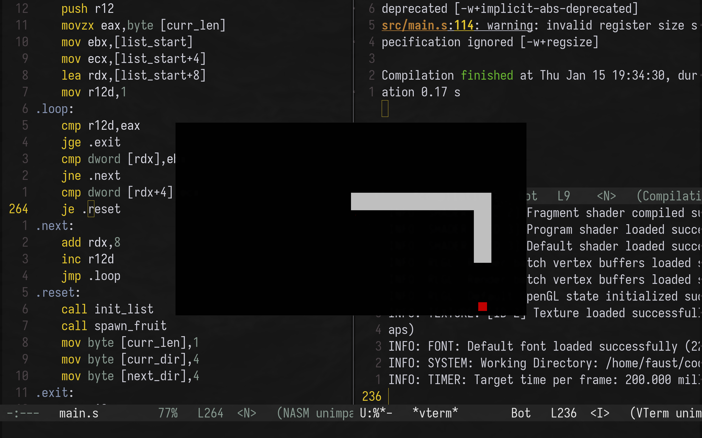

# SNAKE in x64 ASM

snake made with [raylib](https://www.raylib.com/) in x86_64 intel syntax assembly, assembled with NASM

*ONLY WORKS ON x86_64 (AMD64) LINUX*

## Screenshot:

## Dependencies:
* [Netwide Assembler (NASM)](https://www.nasm.us/)
* [ld Linker from GNU](https://ftp.gnu.org/pub/old-gnu/Manuals/ld-2.9.1/html_node/ld_3.html)